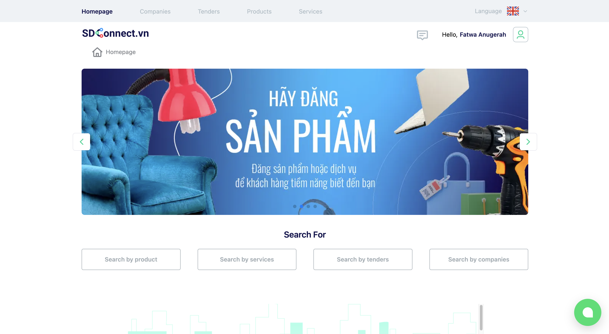
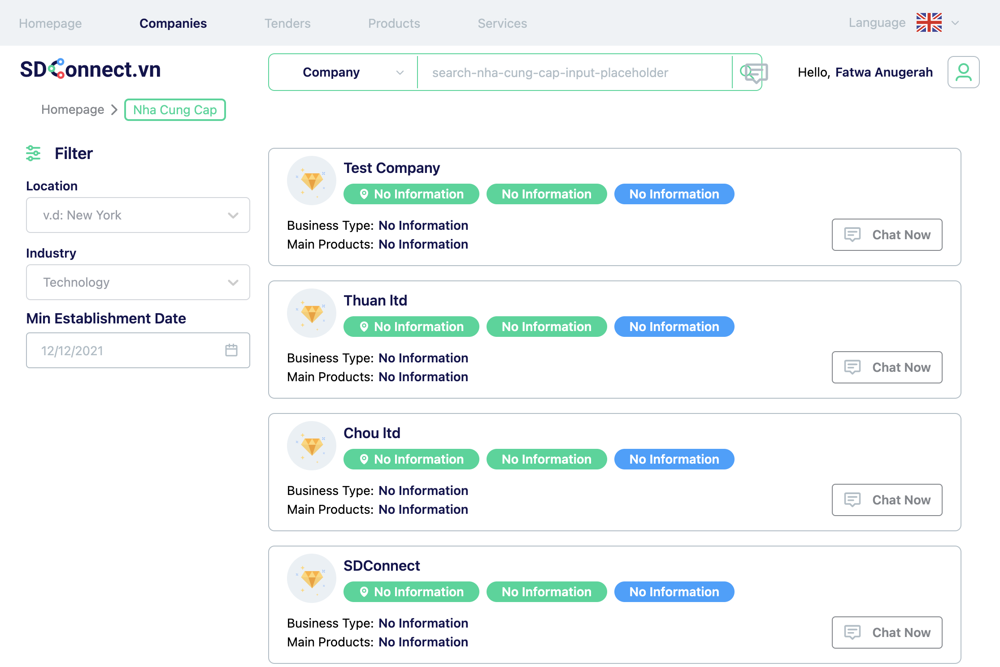
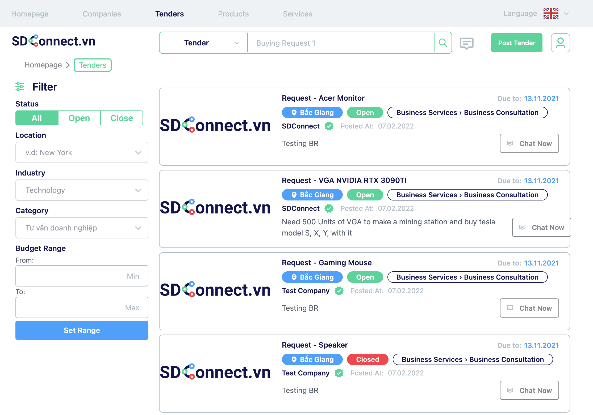
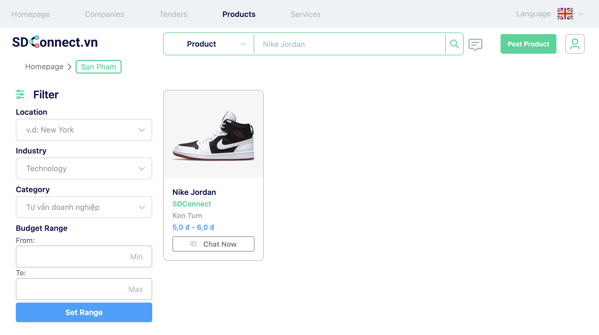
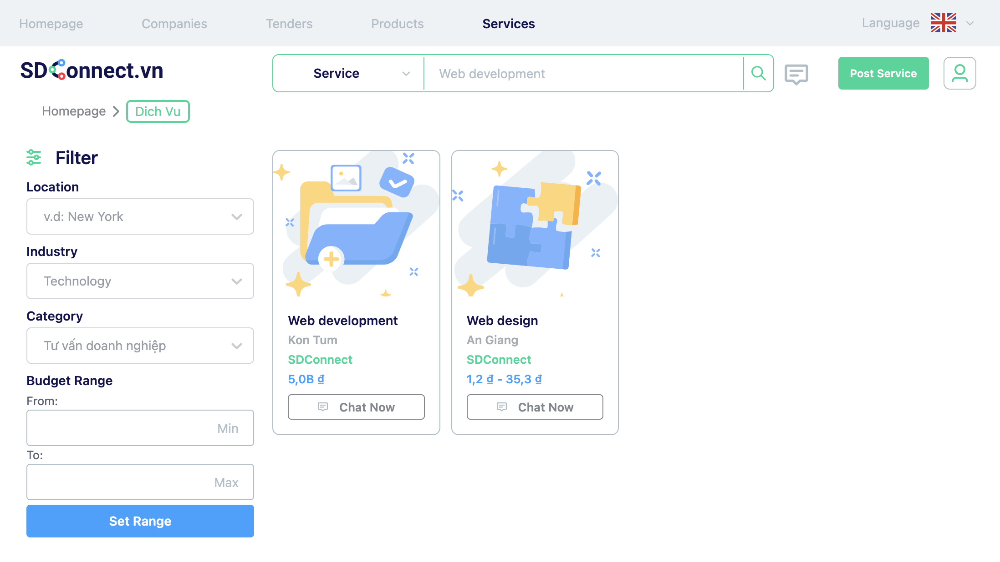

# SDConnect [](https://dev.sdconnect.vn)

> Cùng kết nối - Cùng thành công

## Introduction

SDconnect là sàn thương mại điện tử đầu tiên ở Việt Nam đóng vai trò kết nối nhu cầu Cung - Cầu của DN trong khu CN nói riêng và DN trên toàn Việt Nam nói chung.

Chúng tôi giúp cho DN đa dạng hóa, gia tăng nguồn cung ứng tránh đứt gãy nguồn hàng và tạo cơ hội tiếp cận thêm nhiều cơ hội kinh doanh, nhiều khách hàng mới trên nền tảng của SDconnect.

## Contents

- [APIs](#apis)
- [Frontend](#shop)
  - [Shop](#shop)
    - [Homepage](#homepage)
    - [Companies](#companies)
    - [Tenders](#tenders)
    - [Products](#products)
    - [Services](#services)
  - [Chat](#chat)
  - [Admin](#admin)
- [Contributors](#contributors)
- [License](#license)

# APIs

You have to change directory to `./api` folder. Then following the installation below:

```git
  git clone https://github.com/emolyze/sdconnect
  cd sdconnect/api
  cp .env.example .env
  yarn
  yarn db:migrate
  yarn db:seed
  yarn dev
```

You can read more details at [API README](api/README.MD).

# Shop

You have to change directory to `./frontend/shop` folder and following the installation below:

First, run the development server:

```bash
cd sdconnect/frontend/shop
cp .env.example .env
npm run dev
# or
yarn dev
```

Open [http://localhost:3000](http://localhost:3000) with your browser to see the result.

You can read more details at [SHOP README](frontend/shop/README.md).

## Homepage



## Companies



## Tenders



## Products



## Services



# Admin

You have to change directory to `./frontend/admin` folder and following the installation below:

First, run the development server:

```bash
cd sdconnect/frontend/admin
cp env.example .env
npm run dev
# or
yarn dev
```

Open [http://localhost:3000](http://localhost:3000) with your browser to see the result.

You can read more details at [ADMIN README](frontend/admin/README.md).

> **Note:** You must install full packages and must **MATCH** the version in the `package.json` file.

# **Contributors**

<table>
  <tr>
    <td align="center">
        <a href="https://github.com/Thuan2000"><br /><sub><b>Nguyen Huu Thuan</b></sub></a><br /><a href="#question-kentcdodds" title="Answering Questions">💬</a> <a href="https://github.com/all-contributors/all-contributors/commits?author=kentcdodds" title="Documentation">📖</a> <a href="https://github.com/all-contributors/all-contributors/pulls?q=is%3Apr+reviewed-by%3Akentcdodds" title="Reviewed Pull Requests">👀</a> <a href="#talk-kentcdodds" title="Talks">📢</a>
    </td>
    <td align="center">
        <a href="https://github.com/fatwaanugerah21"><br /><sub><b>Fatwa Anugerah</b></sub></a><br /><a href="#question-kentcdodds" title="Answering Questions">💬</a> <a href="https://github.com/all-contributors/all-contributors/commits?author=kentcdodds" title="Documentation">📖</a> <a href="https://github.com/all-contributors/all-contributors/pulls?q=is%3Apr+reviewed-by%3Akentcdodds" title="Reviewed Pull Requests">👀</a> <a href="#talk-kentcdodds" title="Talks">📢</a>
    </td>
    <td align="center">
        <a href="https://github.com/khanhmomo"><br /><sub><b>Khanh Tran</b></sub></a><br /><a href="#question-kentcdodds" title="Answering Questions">💬</a> <a href="https://github.com/all-contributors/all-contributors/commits?author=kentcdodds" title="Documentation">📖</a> <a href="https://github.com/all-contributors/all-contributors/pulls?q=is%3Apr+reviewed-by%3Akentcdodds" title="Reviewed Pull Requests">👀</a> <a href="#talk-kentcdodds" title="Talks">📢</a>
    </td>
    <td align="center">
        <a href="https://github.com/dcongtinh"><br /><sub><b>Tinh Dao</b></sub></a><br /><a href="#question-kentcdodds" title="Answering Questions">💬</a> <a href="https://github.com/all-contributors/all-contributors/commits?author=kentcdodds" title="Documentation">📖</a> <a href="https://github.com/all-contributors/all-contributors/pulls?q=is%3Apr+reviewed-by%3Akentcdodds" title="Reviewed Pull Requests">👀</a> <a href="#talk-kentcdodds" title="Talks">📢</a>
    </td>
  </tr>
</table>

# **License**

© 2022 Copyright SDConnect.vn
